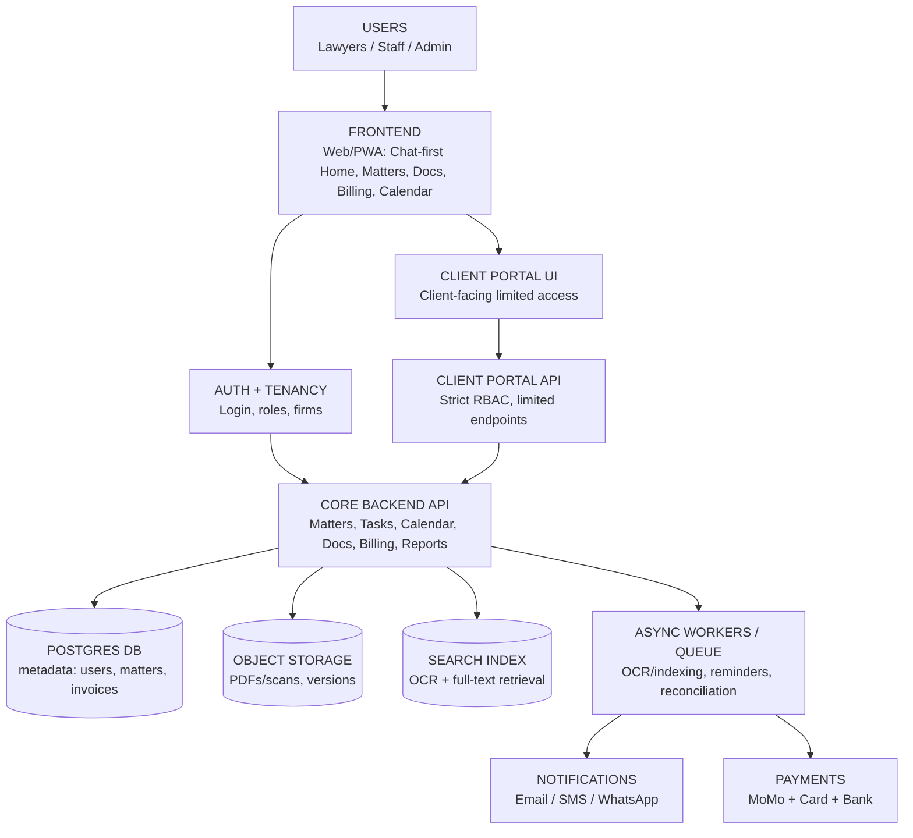
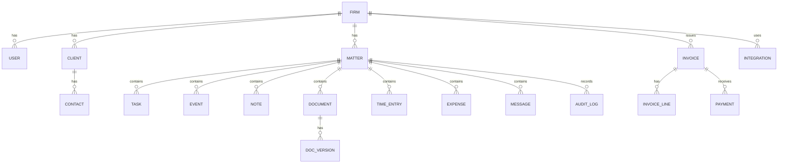
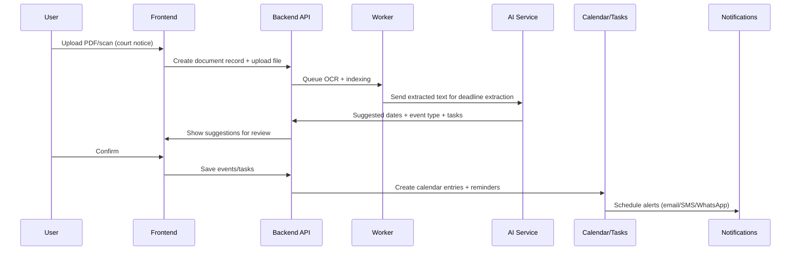
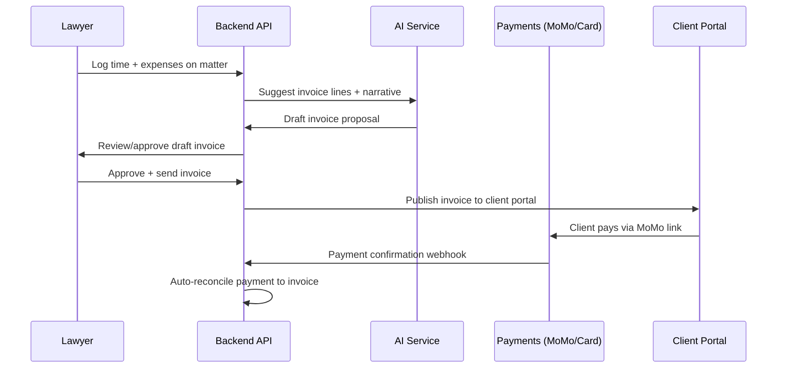
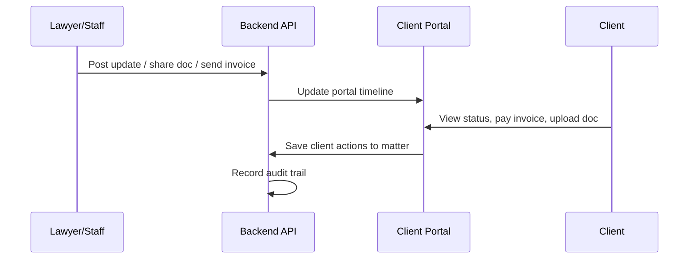

# Ghana Legal Practice Management SaaS — First-Principles System Map (with AI)

This is an **irreducibly simple** map of the entire system for a **Ghana-first, AI-assisted legal practice management SaaS**.  
It’s designed to be understandable from *first principles* and directly usable for planning and building.

---

## First principles

A law firm transforms:

**Inputs**
- Client requests, facts, documents, court notices
- Time spent and expenses

Into:

**Outputs**
- Organized matters
- Work completed on time
- Drafts and documents managed correctly
- Invoices sent and payments collected
- Clear client updates
- A complete audit trail

So the product has 3 core jobs:

1) **Organize work** (Matter system)  
2) **Prove work** (Documents + audit)  
3) **Get paid** (Billing + payments)  

**AI is not the product. AI is a multiplier** that makes these jobs faster.

---

## The minimal mental model

Everything revolves around one object:

### ✅ Matter (the “container”)

A **Matter** holds:

- People (client, opposing party, counsel)
- Tasks
- Deadlines / events
- Documents
- Notes
- Time entries + expenses
- Invoices + payments
- Messages
- Audit log (who did what, when)

If **Matter** is designed cleanly, the whole product stays coherent.

---

## Entire system map (single diagram)



**Summary:** UI → API → DB/Files/Search → Workers → Notifications/Payments + AI embedded in workflow.

---

## The AI layer (what it is)

AI here is **not “legal advice.”**  
It is a set of **assist functions** that:

- Read inputs (docs, notes, activity)
- Generate suggested outputs
- Always require **human review** before committing actions

### AI leverage points (highest ROI, lowest risk)

```mermaid
flowchart LR
  A[Document/Notice Upload] --> B[AI: extract deadlines, parties, matter type]
  B --> C[Suggest calendar entries + tasks]
  C --> D[User reviews & confirms]
  D --> E[Saved to Matter + reminders scheduled]

  F[Matter activity] --> G[AI: matter status summary]
  H[Time + activity] --> I[AI: propose invoice line items + narrative]
  J[Client comms] --> K[AI: draft client update message]
  L[Intake] --> M[AI: intake → client + matter + checklist (MVP+)]
```

---

## The 4 domains of the system

### 1) Work Domain — Matter Operations
**Purpose:** Move matters forward without chaos.

- Matter
- Tasks
- Calendar events
- Notes
- People/contacts

**Output:** Updated matter status + next actions.

---

### 2) Evidence Domain — Documents + Search + Audit
**Purpose:** Store, find, and prove work.

- Files (PDFs/scans/docs)
- Versions
- Tags/metadata
- OCR extraction
- Full-text search index
- Audit trail

**Output:** “I can find the right document instantly and prove it’s the latest.”

---

### 3) Money Domain — Time → Invoice → Payment → Reconciliation
**Purpose:** Get paid faster and reduce leakage.

- Time entries
- Expenses
- Invoice drafts
- Payment links (MoMo + card)
- Partial payments
- Reconciliation
- AR aging

**Output:** Cashflow clarity and faster collections.

---

### 4) Communication Domain — Client Portal + Notifications
**Purpose:** Reduce admin load and increase trust.

- Client portal (status, invoices, docs)
- Secure messaging + file exchange
- Automated reminders (deadlines, unpaid invoices)
- Optional WhatsApp/SMS updates (opt-in)

**Output:** Fewer calls, faster responses, faster payments.

---

## Core data model map (entities & relationships)

This is the simplest entity graph that can run the whole system:



---

## Key end-to-end workflows

### Workflow A — Upload court notice → never miss deadlines



---

### Workflow B — Matter work → invoice → MoMo payment



---

### Workflow C — Client portal reduces admin calls



---

## MVP system boundaries (what NOT to include v1)

To ship fast and reduce legal risk, keep these **out of MVP**:

- AI legal advice / “what should I do?”
- Outcome prediction
- Fully autonomous drafting/filing
- Full legal research database (integrate later instead of competing first)

---

## Minimal architecture choices (clean & buildable)

- **Frontend:** Next.js (chat-first + dashboards)
- **Backend:** FastAPI (Python) *or* Node.js (Nest/Express)
- **DB:** PostgreSQL (multi-tenant)
- **Files:** S3-compatible storage (Cloudflare R2 / AWS S3)
- **Search:** Typesense (easy) or Elasticsearch (powerful)
- **Workers:** Celery (Python) or BullMQ (Node)
- **AI:** separate “AI service” returning **suggestions + references**
- **Payments:** MoMo gateway adapter + card adapter
- **Notifications:** email + SMS + optional WhatsApp

---

## One-page north star

You are building a **Ghana-first law firm operating system** where:

- **Matter** is the core container  
- **Documents are searchable** instantly  
- **Deadlines are hard to miss**  
- **Invoices turn into MoMo payments** quickly  
- **AI reduces admin time** (summaries, deadline extraction, invoice drafts, client updates)  
- Everything is **secure, auditable, and client-friendly**

---

## Next (optional)
If you want, the next artifacts to produce are:

- A **12-week MVP build plan** (week-by-week)
- A **Postgres schema draft** (tables + key fields)
- An **API map** (endpoints and permissions)

